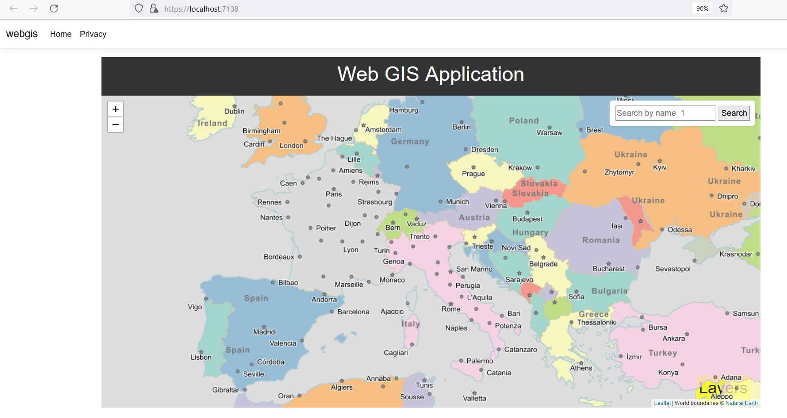

# Web GIS Application

This is a simple Web GIS application built using GeoServer and Leaflet. The application allows users to visualize geographic data layers from a GeoServer instance on an interactive map. It also includes a search feature to locate specific map objects and the ability to toggle the display of different layers on the map.
Features

    Interactive map powered by Leaflet library.
    Display of geographic data layers from a GeoServer instance.
    Search functionality to locate map objects by name_1.
    Layer checklist with checkboxes to toggle the display of layers.
    Professional and responsive design for a user-friendly experience.

# Prerequisites

    GeoServer instance set up with the necessary geographic data layers.
    Leaflet library for interactive maps.

# Getting Started

    Clone the repository: git clone https://github.com/huynhhoc/webgis.git
    Open the project in your preferred code editor.

# Configuration

    Open the map.js file in the js folder.
    Configure the wmsLayer and wmsLayerfr variables to point to your GeoServer instance and respective layers.

# Usage

    Open the index.html file in a web browser.
    The map will load, displaying the configured layers.
    Use the search feature to locate map objects by name_1.
    Click the layer checklist button at the bottom-right to toggle the display of layers.
    Check/uncheck the checkboxes in the layer popup to control the visibility of layers on the map.

    

# Contributing

Contributions are welcome! Please create a pull request with any improvements or fixes.
License

This project is licensed under the MIT License.

Feel free to customize this README to include more specific information about your project and its setup.